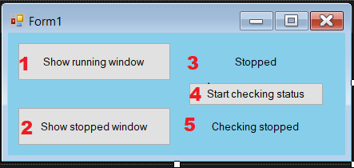
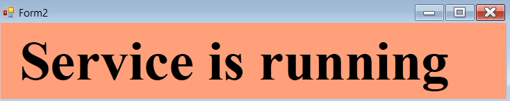
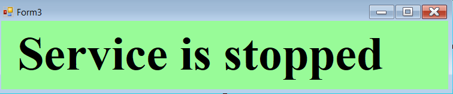

# Service Status

The app checks the status of a particular service in Windows, if the status of the service changes, then the proper window is displayed



1. Open the window that appears when the service starts up


2. Open the window that appears when the service stops


3. Current status of the service

4. Start checking - no need to use, it starts automatically

5. Shows whether the program is currently checking the status of a service

# How to Use

To use it, all you have to do is put the name of the service you want to monitor and put the program into Windows autostart folder

```C#
ServiceController sc = new ServiceController("your service name");
```

